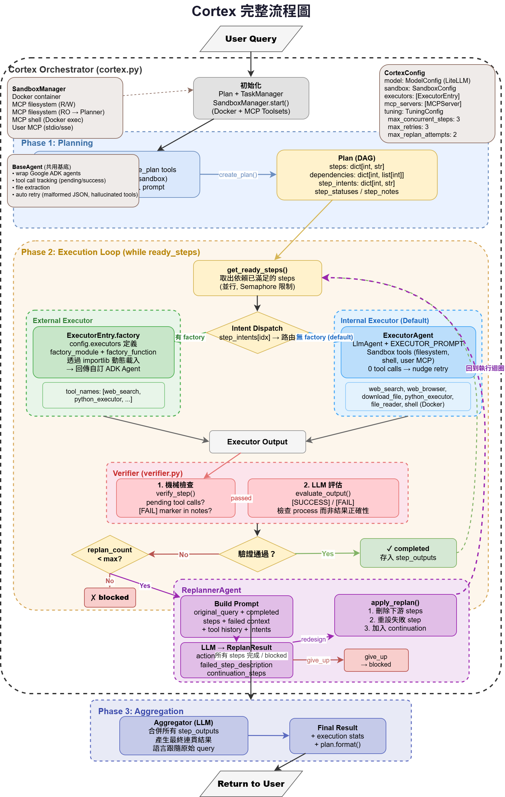
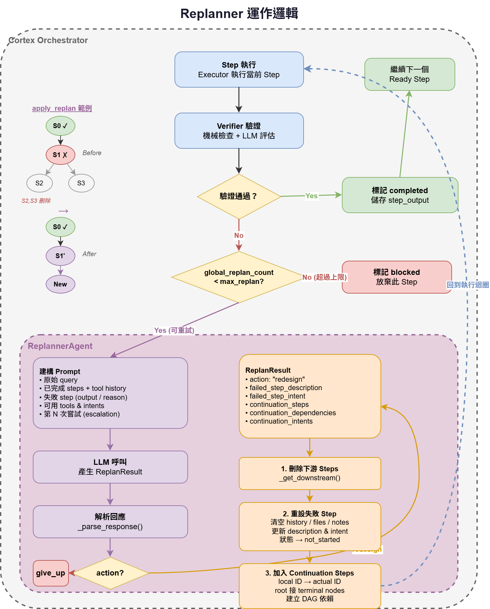
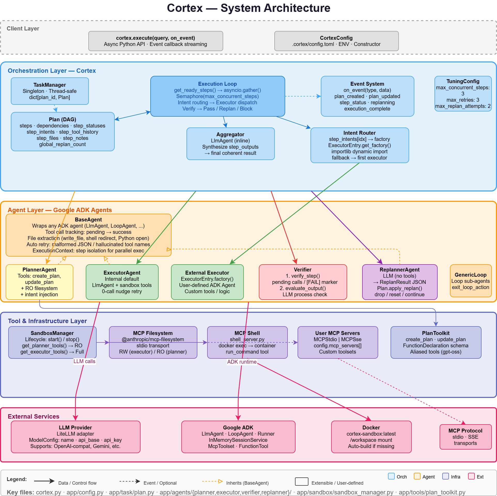

# Cortex

基於 Google ADK 的多步驟 AI Agent 框架。自動將複雜任務拆解為 DAG，並行執行、驗證、重新規劃。



## Quick Start

**環境需求:** Python 3.12+, [uv](https://docs.astral.sh/uv/)

```bash
# 安裝
uv sync

# 設定
cp config.toml.example config.toml
# 編輯 config.toml 填入 LLM 設定

# 設定環境變數
cp .env.example .env
# 編輯 .env 填入 API keys

# 執行（自動帶 timestamp log）
bash scripts/run.sh

# 或直接執行
uv run python example.py

# 執行測試
uv run pytest tests/ -v
```

Log 檔自動儲存在 `logs/run_YYYYMMDD_HHMMSS.log`。

### 設定

複製 `config.toml.example` 為 `config.toml`，填入 LLM 設定：

```toml
[model]
name = "openai/your-model-name"
api_base = "http://localhost:8000/v1"
api_key_env_var = "YOUR_API_KEY"
```

設定檔搜尋順序：`{cwd}/.cortex/config.toml` → `{project_root}/config.toml`

也支援環境變數 (`CORTEX_` prefix) 和建構式參數，優先級：建構式 > 環境變數 > TOML。

### 基本使用

```python
import asyncio
from app.config import CortexConfig
from cortex import Cortex

async def main():
    config = CortexConfig()  # 從 config.toml 讀取
    cortex = Cortex(config)
    result = await cortex.execute("寫一個 Hello World 程式")
    print(result)

asyncio.run(main())
```

### Sandbox 模式

啟用 Docker 沙盒讓 Agent 在隔離環境中操作檔案和執行指令（需安裝 Docker）：

```toml
[sandbox]
enable_filesystem = true
enable_shell = true
```

### 外部 Executor

透過 intent routing 將步驟分派到不同 Executor：

```toml
[[executors]]
intent = "generate"
description = "Generate new code"
factory_module = "app.agents.coding_agent.agent.mistral_vibe._agent"
factory_function = "create_coding_agent"
```

Planner 會自動根據 `available_intents` 為每個步驟選擇最適合的 executor。未匹配的步驟由內部 ExecutorAgent 執行 (`intent = "default"`)。

---

## 自訂 Agent（Custom Executor）

你可以建立自己的 Agent 並透過 `config.toml` 的 `[[executors]]` 整合到 Cortex。完整範例請參考 `general_task/` 目錄。

### 目錄結構

```
my_agent/
├── _agent.py          # Agent 工廠函式（進入點）
├── _config.py         # Agent 自身的配置（選用）
├── _prompt.py         # System prompt 建構（選用）
├── .env               # Agent 專用環境變數（選用）
├── .env.sample        # .env 範例
├── agent.py           # ADK CLI entry point（選用，供 adk web 使用）
└── tools/
    ├── _manager.py    # ToolManager：自動掃描載入所有工具
    ├── web_search.py  # 工具實作（匯出 web_search_tool）
    ├── calculator.py  # 工具實作（匯出 calculator_tool）
    └── prompts/       # 各工具的詳細使用說明（.md）
        ├── web_search.md
        └── calculator.md
```

### 1. 建立工廠函式

工廠函式必須回傳一個 Google ADK Agent（如 `LlmAgent`）。Cortex 會在每個步驟執行時呼叫此函式建立新的 agent 實例。

```python
# my_agent/_agent.py
from google.adk.agents.llm_agent import LlmAgent
from google.adk.models.lite_llm import LiteLlm
from app.agents.base.base_agent import BaseAgent

def create_my_agent() -> LlmAgent:
    model = LiteLlm(
        model="openai/your-model",
        api_base="http://your-api/v1",
        api_key="your-key",
    )
    include_aliases = BaseAgent.should_include_aliases(model)
    tools = get_your_tools(include_aliases=include_aliases)

    return LlmAgent(
        model=model,
        tools=tools,
        name="MyAgent",
        instruction="Your system prompt here",
    )
```

### 2. 處理 Tool Name 幻覺（gpt-oss 模型）

某些模型（如 `gpt-oss`）會在 function call 時產生錯誤的 tool name（如 `web_searchjson`、`python_executorjson<|channel|>commentary`）。使用 `ToolManager` 的別名機制自動產生所有可能的幻覺名稱變體：

```python
# 參考 general_task/tools/_manager.py
def get_all_tools(self, include_aliases: bool = False) -> list[FunctionTool]:
    tools = list(self.tools)
    if include_aliases:
        for tool in self.tools:
            for suffix in self._generate_alias_suffixes():
                alias_name = f"{tool.func.__name__}{suffix}"
                wrapper = create_wrapper(tool.func, alias_name)
                tools.append(FunctionTool(wrapper))
    return tools
```

`BaseAgent.should_include_aliases(model)` 根據模型名稱自動判斷是否需要別名。

### 3. 註冊到 config.toml

```toml
[[executors]]
intent = "my_intent"
description = "描述這個 agent 的能力，Planner 會根據此描述分配步驟"
factory_module = "my_agent._agent"
factory_function = "create_my_agent"
tool_names = ["web_search", "calculator", "python_executor"]
```

- **intent**: 唯一識別名稱，Planner 會在規劃時將步驟標記為此 intent
- **description**: Planner 用來決定哪些步驟該分配給此 agent
- **factory_module / factory_function**: 工廠函式的 Python module path 和名稱
- **tool_names**: 此 agent 可用的工具名稱列表，Replanner 重新規劃時會參考

---

## 執行流程

### 三階段流程

1. **Planning** — PlannerAgent 分析任務，產生 Plan（DAG：步驟 + 依賴關係 + intent 分配）
2. **Execution Loop** — 並行引擎依 DAG 依賴關係執行步驟，Verifier 驗證，失敗時 Replanner 重新規劃
3. **Aggregation** — 彙整所有步驟結果為最終回答

```python
# 路由邏輯（簡化）
intent = plan.get_step_intent(step_idx)
factory = self._get_executor_factory(intent)
if factory:
    agent = factory()                              # 呼叫工廠函式
    executor = BaseAgent(agent=agent, plan_id=plan_id)
    result = await executor.execute(query_text, exec_context=exec_context)
```

### Replanner 重新規劃

當步驟驗證失敗時，ReplannerAgent 會重新設計該步驟及後續工作：



- **重設失敗步驟**：提供新的 description（不同策略），系統自動刪除失敗步驟的所有下游依賴
- **Continuation Steps**：規劃後續步驟（local IDs），系統自動 map 到實際 ID 並連接到 DAG 的 terminal nodes
- **Global Replan Count**：跨步驟共享的重試計數器，達上限後標記為 blocked

---

## 核心元件

| 元件 | 位置 | 職責 |
|------|------|------|
| **Cortex** | `cortex.py` | 主控制器：協調規劃、執行、驗證、重試 |
| **PlannerAgent** | `app/agents/planner/` | 將任務拆解為步驟 + 依賴關係 + intent 分配 |
| **ExecutorAgent** | `app/agents/executor/` | 預設執行者（純執行，不管理 plan 狀態） |
| **Verifier** | `app/agents/verifier/` | 雙階段驗證：機械檢查 + LLM 評估 |
| **ReplannerAgent** | `app/agents/replanner/` | 失敗步驟重設 + 下游刪除 + continuation sub-graph |
| **Plan** | `app/task/plan.py` | DAG 資料結構（步驟、狀態、依賴、工具歷史） |
| **TaskManager** | `app/task/task_manager.py` | 全域 Plan 管理器（thread-safe） |
| **SandboxManager** | `app/sandbox/` | Docker 容器 + MCP 工具生命週期管理 |
| **CortexConfig** | `app/config.py` | Pydantic Settings（TOML + 環境變數 + 建構式） |

### 目錄結構

```
cortex/
├── cortex.py                   # 主控制器
├── api.py                      # FastAPI 微服務
├── config.toml.example         # 設定檔範例
├── example.py                  # 使用範例
├── scripts/
│   └── run.sh                  # 執行腳本（自動 log）
├── app/
│   ├── config.py               # Pydantic Settings 設定模型
│   ├── agents/
│   │   ├── base/base_agent.py  # BaseAgent（包裝 ADK Agent + tool alias）
│   │   ├── planner/            # PlannerAgent + prompts
│   │   ├── executor/           # ExecutorAgent + prompts
│   │   ├── verifier/           # Verifier（機械 + LLM 驗證）
│   │   └── replanner/          # ReplannerAgent + prompts
│   ├── sandbox/                # Docker 沙盒 + MCP 工具
│   ├── task/                   # Plan + TaskManager
│   └── tools/                  # PlanToolkit (create_plan, update_plan)
├── general_task/               # 內建通用 Agent（自訂 Agent 範本）
│   ├── _agent.py               # 工廠函式
│   ├── _config.py              # 配置單例
│   ├── _prompt.py              # System prompt
│   └── tools/                  # 12 個工具 + prompts/
├── tests/                      # 280 tests
└── frontend/                   # React + Vite 前端（選用）
```

---

## API

### FastAPI 微服務

```bash
uv run uvicorn api:app --reload --port 8999
```

| Method | Endpoint | 說明 |
|--------|----------|------|
| `POST` | `/api/tasks` | 建立任務 `{"query": "..."}` → `{"task_id": "...", "status": "accepted"}` |
| `GET` | `/api/tasks/{task_id}/events` | SSE 事件串流（即時規劃進度 + 執行結果） |

### SSE 事件類型

| 事件 | 說明 |
|------|------|
| `connected` | 連線成功 |
| `plan_created` | 規劃完成，包含步驟清單 |
| `step_started` / `step_completed` | 步驟開始 / 完成 |
| `execution_complete` | 全部完成，包含最終結果 |
| `error` | 執行錯誤 |

### Frontend

```bash
cd frontend && npm install && npm run dev
# 開啟 http://localhost:5173
```

即時視覺化規劃進度、Agent 思考過程、工具呼叫細節，支援 Markdown 渲染與斷線重連。

---

## Contributing

### 開發環境

```bash
uv sync
uv run pre-commit install
```

### 程式碼規範

本專案遵循 [Google Python Style Guide](https://google.github.io/styleguide/pyguide.html)：

- `from __future__ import annotations` 在每個檔案開頭
- Type hints 使用 `X | None` 而非 `Optional[X]`
- 函式簽名標註回傳型別（包含 `-> None`）
- Import 順序：標準庫 → 第三方 → 本地（由 ruff isort 自動排序）

### 品質檢查

每次 commit 會自動執行以下檢查（pre-commit hook）：

| 工具 | 用途 |
|------|------|
| `ruff check --fix` | Linting + 自動修復 |
| `ruff format` | 程式碼格式化 |
| `mypy` | 靜態型別檢查 |

```bash
uv run ruff check --fix .
uv run ruff format .
uv run mypy .
uv run pytest tests/ -v
```

**所有 PR 必須通過 ruff、mypy 零錯誤、全部測試通過。**

---

## System Architecture



---

## License

MIT
